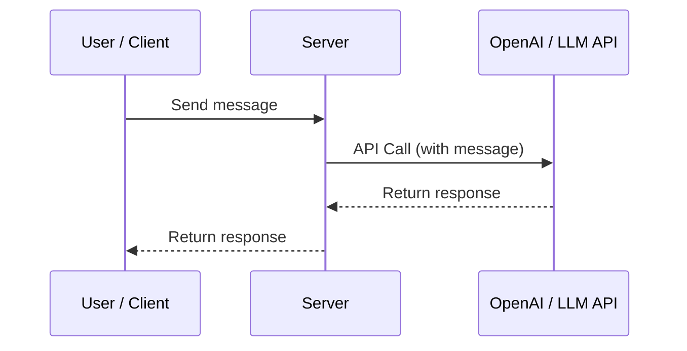
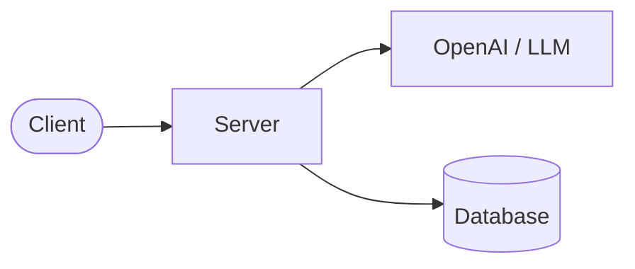
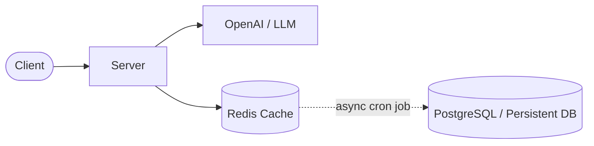
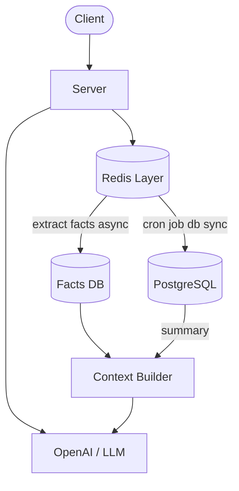
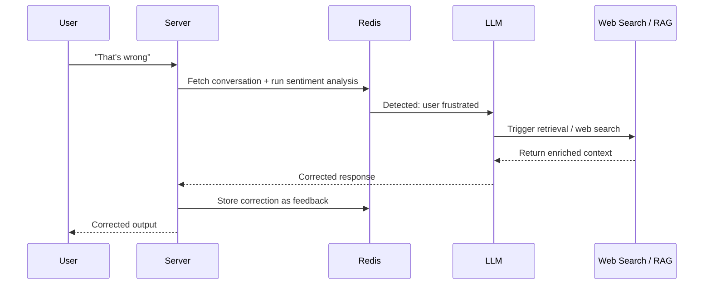
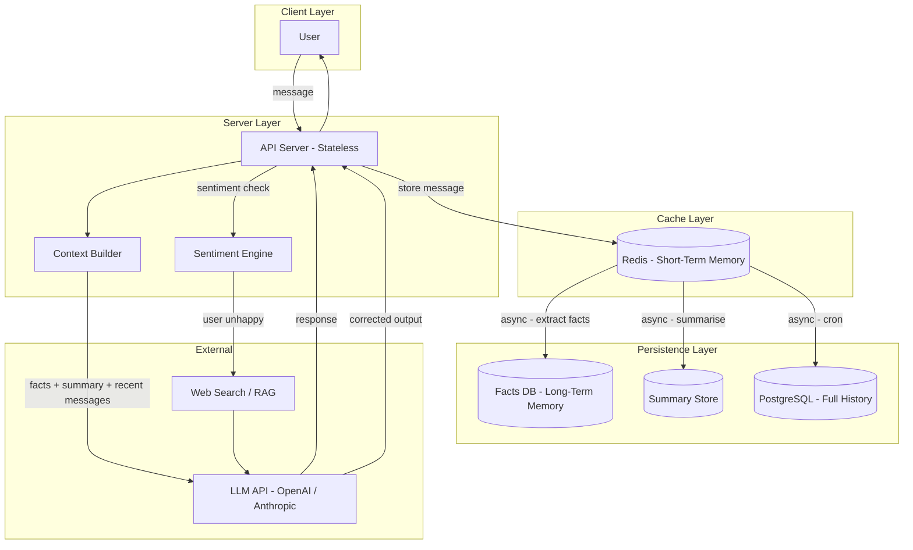

You open Cursor, start a conversation about a bug in your codebase, and thirty messages later it still knows what you were originally trying to fix. That feels magical — but it is engineering, not magic. Understanding how it works will make you a better AI tool user *and* a better engineer building on top of LLMs.

This post traces the full architecture of context management: from the naive approach that breaks immediately, through the trade-offs of each fix, to the production-grade design that modern AI coding assistants use today.

---

## The Problem: LLMs Have No Memory

A Large Language Model is, at its core, a stateless function. Every time you call it, you hand it a block of text (the **context window**), and it returns a completion. It has no awareness of anything outside that single call.

Consider this basic chat service:

```
User → Server → POST /chat → LLM API
```



Now imagine this conversation:

```
User:  Hi, I'm Savitha.
LLM:   Hello! How can I help you today?

... 20 messages later ...

User:  What's my name?
LLM:   I don't have that information.
```

The LLM is not being obtuse — it genuinely does not have access to that earlier message. Unless you explicitly include previous messages in every API call, the model starts fresh each time.

This is the **statelessness problem**, and solving it is the entire game.

---

## Naïve Fix #1: Store History on the Client

The simplest idea: keep the full conversation in the browser and send it with every request.

This fails for two significant reasons:

1. **Security**: The client owns the data. A user could tamper with the conversation history — injecting fake context, impersonating the assistant's prior responses, or manipulating the model's behaviour. You've handed control of your system prompt to an untrusted party.
2. **Durability**: What happens when the user clears their browser, switches devices, or opens a new tab? The conversation is gone. Cross-device continuity is impossible.

Client-side storage is appropriate for ephemeral UI state. Conversation history is application state. These are different things.

---

## Naïve Fix #2: Store History on the Server (In-Memory)

Alright — keep the history in server memory, keyed by session ID.

```
Server RAM: { sessionId → [messages] }
```

This is now a **stateful server**, and stateful servers are expensive to scale correctly.

- **Horizontal scaling breaks it.** If you have three server instances behind a load balancer and a user's second request lands on a different instance, their history is gone. You'd need session affinity (sticky sessions), which defeats the purpose of horizontal scaling.
- **Vertical scaling is a dead end.** You can only make one machine so large, and it's a Single Point of Failure (SPOF). If it crashes, every active conversation is lost.
- **Memory exhausts quickly.** At 150 concurrent users sending 2 messages each per second, you're writing 300 message records per second to RAM. Long-running conversations compound this rapidly.

The server should be **stateless**. Persistence belongs in a persistence layer.

---

## The Correct Foundation: Persist to a Database



The server now stores every message — user and assistant alike — in a database, keyed by `conversationId`. On each new message, it fetches the full history, prepends it to the new message, and sends the whole thing to the LLM.

This solves durability and statefulness. But it introduces two new problems:

**Latency.** Every message now requires a round-trip to the database *before* hitting the LLM. At 300 writes/second, with each write also triggering a read of the entire history, your database becomes a bottleneck fast. P99 latency degrades. Users notice.

**Cost.** LLM APIs charge per token. Sending the full conversation history with every request means token counts grow linearly with conversation length. A 50-message conversation costs 50× more per call than a 1-message conversation, for the same response.

These aren't deal-breakers — they're trade-offs that demand a smarter approach.

---

## Introducing a Cache Layer: Redis

The fix for the latency problem is to stop writing to your database on the hot path. Instead, buffer recent messages in **Redis** — an in-memory data store designed for exactly this use case.



**The write path**: New messages go to Redis immediately (microsecond writes). A background job (cron or a queue consumer) asynchronously flushes them to the persistent database.

**The read path**: Recent history is served from Redis (sub-millisecond reads). The LLM call is no longer blocked by a database round-trip.

**Eviction strategy**: Redis is bounded by memory, so you need an eviction policy. LRU (Least Recently Used) is a natural fit — conversations that haven't been touched recently are evicted first.

This is the **write-behind caching** pattern, and it's standard in chat systems at scale.

One important detail: you need to decide *which* messages to persist when Redis evicts them. Not all messages carry equal weight. A message saying "ok" carries less information than "my name is Savitha and I'm building a fintech app." This distinction becomes central to the next problem.

---

## The Context Window Limit: The Real Constraint

Here is the fundamental constraint you cannot engineer away: **LLMs have a fixed context window**.

Older models had 4,096 tokens. Modern models have 128K or more — but the constraint still exists, and even 128K tokens fills up faster than you'd expect in a long coding session or a deep research conversation.

When you approach the limit, you can't just send the whole history. You must decide what to drop.

Dropping arbitrarily — say, the oldest messages — is the naïve approach. It loses critical context. The user mentioned their database schema in message 3. Dropping that makes every subsequent answer worse.

The standard production approach kicks in at around **85–90% of the context window**:

1. Compress the existing history down to ~20% of the window.
2. Append new messages to that compressed representation.
3. When you hit 85–90% again, repeat.

The question is: *how do you compress without losing what matters?*

---

## Context Summarisation

The first technique is **summarisation**: send the conversation history to an LLM and ask it to produce a dense summary, then replace the raw messages with that summary.

```
[Full history: 80 messages] → [Summary: 3–5 paragraphs] + [Last 10 messages verbatim]
```

This preserves the narrative arc of the conversation at a fraction of the token count. It works well for conversational context — "we were discussing X, the user tried Y, it didn't work because Z."

But summarisation has a structural weakness: **compression is lossy**. An LLM deciding what's important will inevitably drop something that later turns out to matter. The more you compress, the more you lose.

This is fine for atmosphere and continuity. It is *not* fine for facts.

---

## Factual Extraction: Structured Memory

The second technique addresses the lossy summarisation problem directly: before compressing, **extract discrete facts** and store them separately in a dedicated database.

```
name: 'Savitha'
country: 'India'
hobbies: ['coding', 'cycling', 'photography']
```

These facts are not compressed — they are extracted, normalised, and stored as structured key-value pairs. On every subsequent LLM call, you inject the relevant facts directly into the system prompt, regardless of how far back in the conversation they were mentioned.



**The context sent to the LLM on each call** now looks like:

```
[System prompt]
[Injected facts from Facts DB]
[Summary of earlier conversation]
[Last N messages verbatim from Redis]
[User's new message]
```

This is what Claude is doing when it appears to "remember" you across sessions. It is not magic — it is structured retrieval.

---

## Memory Types: A Taxonomy

With this architecture in place, it's worth naming the two distinct layers of memory formally, because they map directly to system components:

| Memory Type | Scope | Storage | Use Case |
|---|---|---|---|
| **Short-Term Memory** | Current session | Redis | Recent message history, in-progress context |
| **Long-Term Memory** | Cross-session | Facts DB + PostgreSQL | User facts, entities, preferences, relationships |

Short-term memory is cheap and fast but ephemeral. Long-term memory is durable and queryable but requires deliberate extraction.

A well-designed AI system manages both explicitly. Most toy implementations only handle short-term memory, which is why they feel forgetful across sessions.

---

## The Subconscious Layer: Sentiment-Aware Correction

The architecture so far handles *what* the model knows. This final layer handles *how* the model responds when things go wrong.

Users signal frustration implicitly: "that's not right", "no, I meant—", "you're not understanding me". These signals rarely carry enough information for the LLM to self-correct from context alone.

The **subconscious brain** pattern adds a reactive feedback loop:

1. **Sentiment detection**: After every assistant response, a lightweight model (or the same LLM with a short prompt) runs sentiment analysis on the user's reply. Is the user satisfied or frustrated?
2. **Escalation**: If frustration is detected, the system escalates — it triggers a web search or retrieval-augmented generation (RAG) call to pull in external information that might correct the response.
3. **Re-synthesis**: The enriched context (facts + summary + recent messages + retrieved information) is reassembled and the LLM generates a corrected output.
4. **Feedback to Redis**: The outcome is stored back in the cache layer so the correction informs future responses.



This is analogous to how a skilled human expert behaves in conversation: they read your reaction, recognise when they've missed the mark, and proactively go look for better information rather than defending a wrong answer.

In production systems (Perplexity, Cursor, Claude), this pattern is more sophisticated — using explicit thumbs-up/thumbs-down signals, retrieval re-ranking, and fine-tuning pipelines — but the core loop is the same.

---

## The Complete Architecture

Bringing it all together:



**Each component has a single responsibility:**

- **API Server**: Stateless. Orchestrates the flow. Never holds conversation state in memory.
- **Redis**: The hot path. Fast reads and writes for the active session.
- **Context Builder**: Assembles the LLM prompt from facts, summary, and recent messages.
- **Facts DB**: Durable long-term memory. Extracted, not compressed.
- **Summary Store**: Compressed narrative of older conversation history.
- **PostgreSQL**: Full audit log. Source of truth for reprocessing and fact re-extraction.
- **Sentiment Engine**: Reactive feedback loop. Triggers when the user signals dissatisfaction.

---

## Further Reading
 
### Memory Architecture & Theory
 
- **[MemGPT: Towards LLMs as Operating Systems](https://arxiv.org/abs/2310.08560)** 
 
- **[MemGPT Paper Review + Letta Implementation](https://www.leoniemonigatti.com/papers/memgpt.html)** 
 
- **[Memory Blocks: The Key to Agentic Context Management (Letta)](https://www.letta.com/blog/memory-blocks)** 
 
### Mem0: Memory Types Deep Dive
 
- **[Mem0 Memory Types — Official Docs](https://docs.mem0.ai/core-concepts/memory-types)** 
 
- **[State of AI Agent Memory 2026 (Mem0 Blog)](https://mem0.ai/blog/state-of-ai-agent-memory-2026)** 
 
- **[AI Memory Layer: Everything You Need to Know (Mem0 Blog)](https://mem0.ai/blog/ai-memory-layer-guide)** 
 
### Practical Implementation
 
- **[Mem0 Tutorial — DataCamp](https://www.datacamp.com/tutorial/mem0-tutorial)** 
 
- **[AI Agent Memory: Manual, Mem0, LangMem & AWS AgentCore (DEV Community)](https://dev.to/sudarshangouda/ai-agent-memory-from-manual-implementation-to-mem0-to-aws-agentcore-2d7c)** 


---

