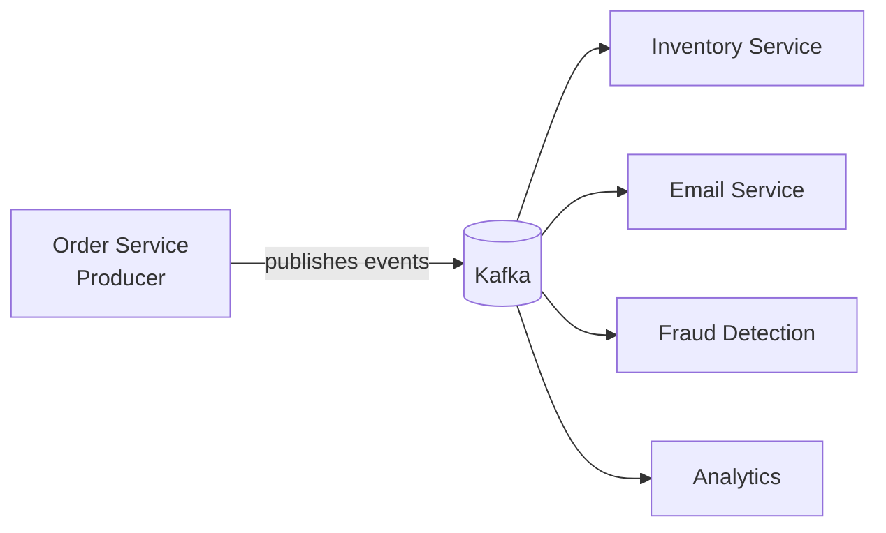
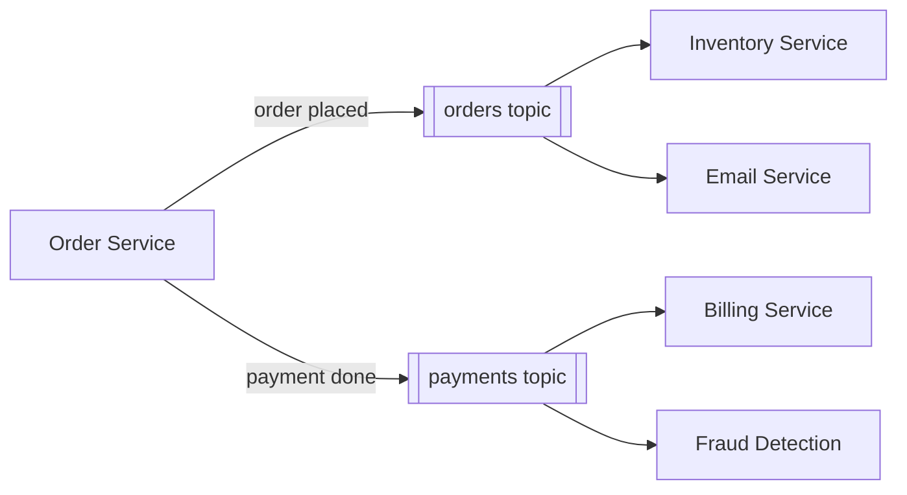
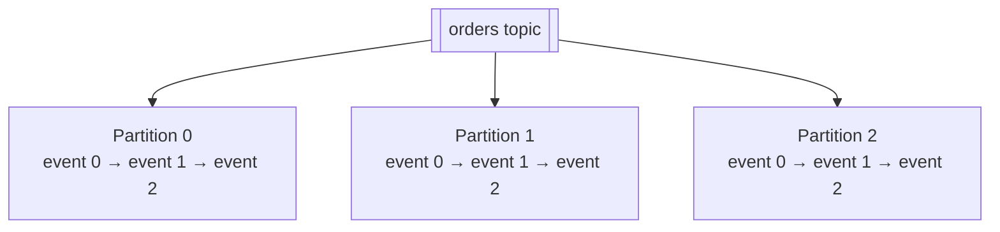
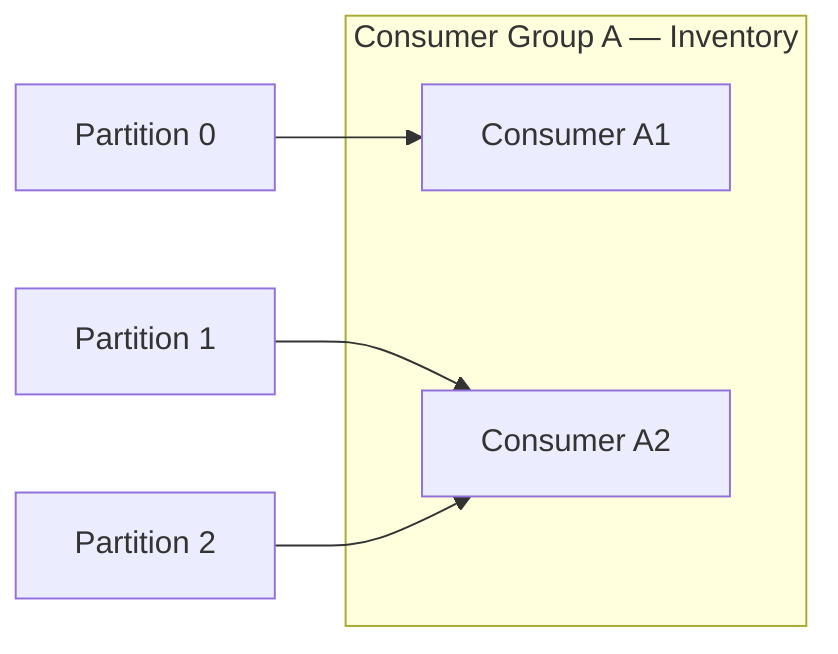
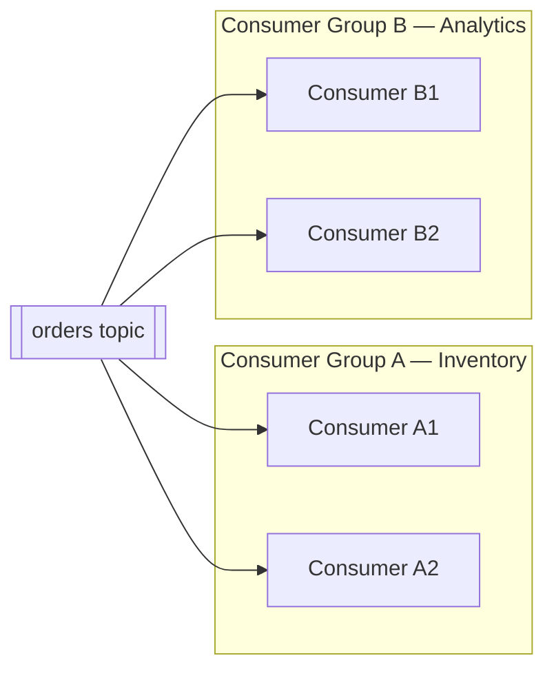
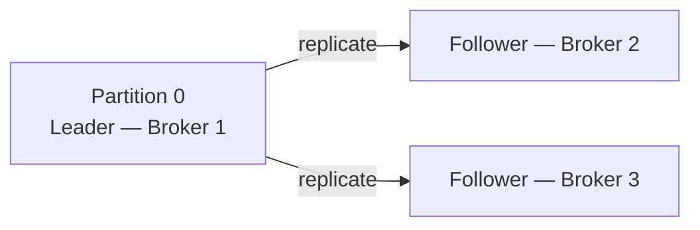

Picture a busy café on a Monday morning.

Orders are flying in — flat whites, oat lattes, avocado toasts. The cashier takes each order and calls it out. The barista makes drinks. The kitchen handles food. Everyone works in parallel, at their own pace.

Now imagine if the cashier had to personally walk to the barista, wait for the drink, walk to the kitchen, wait for the food, then come back to the next customer. The queue would be out the door in minutes.

That's what happens when backend services talk to each other directly. And Kafka is the solution — it's the counter where orders are placed, tracked, and picked up independently by whoever needs them.

| Café | Kafka |
|---|---|
| Cashier | Producer |
| The counter / order slip | Topic |
| Barista, kitchen, packaging | Consumers |
| Order number on the slip | Offset |
| Multiple staff reading the same slip | Consumer groups |
| Slips don't disappear once read | Message retention |

---

## The Real Problem: Services Talking Directly

Most backend systems start simple:
```
Order Service → Inventory Service
```

Service A calls Service B. Works fine.

But products grow. Now three other services also need to know when an order is placed — email confirmation, fraud detection, analytics. So now:
```
Order Service → Inventory Service
             → Email Service
             → Fraud Detection
             → Analytics
```

You've wired everything together. Tight coupling. If the email service is slow, the order service waits. If analytics goes down, order placement might fail. Every new consumer means touching the order service again.

This doesn't scale. And it definitely doesn't survive production.

---

## Kafka: A Central Message Pipeline

Kafka puts a pipeline in the middle. Producers drop events into it. Consumers read from it. Nobody talks to each other directly.


The order service fires an event and moves on. It doesn't know — or care — who picks it up. You can add a fifth consumer tomorrow without touching the order service at all.

That's the core idea. Everything else builds on top of it.

---

## What's a Message Stream?

Think of it like a river of events. Not a queue where messages disappear once read — more like a log that keeps everything in order, permanently.

Every action in your system — "order placed", "payment processed", "user signed up" — becomes an event that flows through Kafka. Consumers tap into the stream and read events at their own pace.

Old events don't vanish when one consumer reads them. Another consumer can read the exact same event independently. And if a consumer was down for an hour, it can catch up from exactly where it left off.

---

## Topics: Named Channels

Kafka organises events into **topics**. A topic is just a named channel — `orders`, `payments`, `user-signups`.

Producers write to a topic. Consumers subscribe to a topic. Multiple consumers can read the same topic independently without interfering with each other.


Clean separation. Each topic is its own stream of events.

---

## Partitions: How Kafka Handles Scale

A single topic can receive millions of events per second. One machine can't handle that. So Kafka splits each topic into **partitions** — parallel lanes.


Each partition is an ordered, append-only log. Events within a partition are strictly ordered. Kafka distributes partitions across multiple servers (brokers), so no single machine is a bottleneck.

Each event in a partition gets a sequential number — its **offset**. Consumers track their own offset. This is what makes Kafka powerful: a slow consumer doesn't block a fast one, and any consumer can replay events from any point just by resetting its offset.

> **A common gotcha:** ordering is guaranteed *within* a partition, not across the entire topic. If you need all events for a specific order to be processed in sequence, use a consistent partition key (like `order_id`) so they always land in the same partition.

---

## Consumer Groups: Sharing the Work

One consumer reading a high-throughput topic won't keep up. Kafka lets you form a **consumer group** — multiple consumers splitting the partitions between them.


Each partition is owned by exactly one consumer within the group. Add more consumers and Kafka rebalances automatically. Remove one and Kafka redistributes its partitions.

**The ceiling:** you can never have more active consumers in a group than you have partitions. If you have 3 partitions and 5 consumers, 2 of them sit idle. This is why partition count matters when you're planning for scale.

Different consumer groups are completely independent:


Group A and Group B both read the same topic — each with their own offsets, their own pace, zero interference. Neither group knows the other exists. Kafka doesn't delete messages when one group reads them. Both read the full stream.

---

## Why Kafka Is Fast

Kafka's throughput comes from a few deliberate choices:

**Append-only writes.** Kafka never edits or deletes existing messages — it only appends. Sequential disk writes are far faster than random ones. Same reason databases prefer append-only WAL logs.

**Zero-copy reads.** Kafka uses OS-level `sendfile()` to move data directly from disk to the network socket, bypassing the application layer. Less CPU, more throughput.

**Batching.** Producers group thousands of messages together before sending. Consumers fetch in bulk. Fewer network round trips, much higher throughput.

**Horizontal scaling.** More load? Add partitions, add brokers. Kafka distributes work automatically. There's no single node that becomes the ceiling.

This is why Kafka can comfortably handle millions of events per second on commodity hardware.

---

## How Kafka Keeps Messages Safe

Every partition is replicated across multiple brokers. One broker is the **leader** — it handles all reads and writes for that partition. The others are **followers** — they replicate the leader's data continuously.


If the leader goes down, a follower is automatically elected. No data loss. No manual intervention. Kafka keeps going.

Combined with configurable **retention** (7 days, 30 days, or forever), you get:

- **Durability** — messages survive broker failures
- **Replayability** — consumers can rewind to any offset and replay past events
- **Auditability** — a complete, ordered history of everything that happened

This is why Kafka is called an **event streaming platform**, not just a message queue. The log is the source of truth.

---

## The Mental Model

> Kafka is a **central, durable, append-only log** of events. Producers write to it. Consumers read from it at their own pace. Topics organise events by type. Partitions make it parallel. Consumer groups share the work.

Once that clicks, everything else — replication, stream processing with Kafka Streams, log compaction — is just detail layered on top of this foundation.

---
